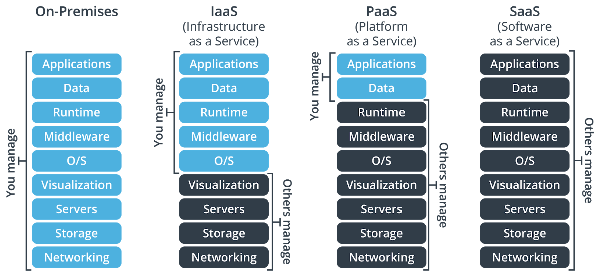

# Lesson 1: Introduction to Azure development

Azure: Cloud computing platform with benefits such as:
- **Scalability**: Applications can be scaled in two ways:
    - Vertically: Computing capacity can be increased by adding RAM or CPUs to a virtual machine.
    - Horizontally: Computing capacity can be increased by adding instances of a resource, such as adding more virtual machines to your configuration.
- **Availability (99.9%+ uptime)**: Continuous user experience with no apparent downtime
- **Elasticity**: Applications can be configured to take advantage of autoscaling
- **Agility**: Resources can be deployed and configured quickly as your application requirements change
- **Security (disaster recovery)**: Cloud-based backup services, data replication, and geo-distribution
- **Development services** (Source control, Unit and integration testing, etc.)

Some of the Azure products are:
- App Services
- Virtual Machines
- Azure SQL Databases
- Blob Storage
- Azure Active Directory
- Aspects of Azure Monitor, such as logs and alerts

### What is the cloud?
Collection of servers on the internet that store and manage data, run apps, and deliver content such as email or videos.
 
#### Advantages:
- Cost: The cloud provider handles all the upfront costs associated with buying hardware, along with on-going maintenance costs
- Scale: Most are pay-as-you-go depending on demand (elasticity), and can be expanded as needed
- Reliability: Management of backups, disaster recovery, etc. is made easier
- Security: Policies and controls are already in place to protect your data

#### Disadvantages:
- It is internet-based, so it can be prone to outages and fluctuations in speed
- Sensitive, private and core data is physically located on someone else's server
- Cloud services will be tailored and customized for your specific cloud instance, potentially making it hard to quickly change providers

### What is cloud computing?
The delivery of computing services over the cloud by using a pay-as-you-go pricing model. These services include servers, storage, databases, networking,
software, analytics, and intelligence

### What are cloud service models?

- **Infrastructure as a service (IaaS)**: A cloud provider keeps the hardware up to date, but operating system maintenance and
        network configuration is left to the cloud tenant
- **Platform as a service (PaaS)**: The cloud provider manages the virtual machines and networking resources, and the cloud tenant
        deploys their applications into the managed hosting environment
- **Software as a service (SaaS)**: The cloud provider manages all aspects of the application environment, such as virtual machines,
        networking resources, data storage, and applications. The cloud tenant only needs to provide their data to the
        application managed by the cloud provider

