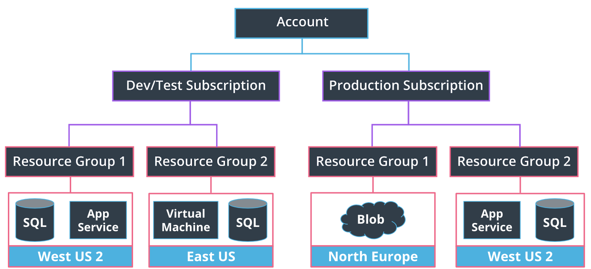

# Lesson 2: Azure compute services
Azure uses a hierarchical system to keep resources organized and to manage expenses:

1. Azure Account
2. Subscription level: Used for billing. There can be multiple per account (i.e. one for development and testing, and another for production systems)
2. Resource Groups (tied to a region)

There is a variety of compute services in Azure:
- Virtual Machines
- App Services
- Azure Batch
- Azure Functions
- Container Instances
- Service Fabric
- Azure Kubernetes Service (AKS)

This lesson focuses on **Virtual Machines** and **App Services**

## Azure Virtual Machine
A IaaS option giving you full access to the underlying operating system of a compute resource. 

Pros:
- VMs allow you full access and control of the VM.
- Support of both Linux and Windows VMs.
- Multiple types to choose from, such as compute or memory-optimized VMs, along with varying amounts of CPU, RAM and storage.
- VMs allow for the installation of custom images and are an excellent choice for migrating from an on-premises server to the cloud.
- Multiple VMs can be grouped to provide high availability, scalability, and redundancy (There are two options when it comes to scaling—Virtual Machine: Scale Sets and Load Balancers). 

Cons:
- Lower up-front cost compared to purchasing and maintaining hardware, but they are more expensive compared to Azure App Service.
- They can be more time consuming for the developer than other compute options

## Azure App Service
A PaaS option allowing developers to focus more on their apps than the underlying infrastructure. It is an HTTP-based service for hosting web applications, REST APIs, and mobile back ends. 

Pros:
- It supports multiple languages and continuous deployment.
- High availability, auto-scaling and support of both Linux and Windows environments.
- Vertical or Horizontal scaling. Vertical scaling increases or decreases resources allocated to our App Service, such as the amount of vCPUs or RAM, by changing the App Service pricing tier. Horizontal scaling increases or decreases the number of Virtual Machine instances our App Service is running.
- You can set the amount of hardware allocated to host your application, and cost varies based on the plan you choose. There are three different tiers - Dev/Test, Production, and Isolated. We’ll be using the free option within Dev/Test for the exercises in this course.

Cons:
- You have limited access to the host server, so you are unable to control the underlying OS or install software on the server.
- You’re always paying for the service plan, even if your services or application isn’t running.
- There are hardware limitations, such as a maximum of 14GB of memory and 4 vCPU cores per instance
- While they support multiple languages, as noted in the benefits above, they are limited to just using those languages (as of when this course was built).

## What are their use cases?
- Virtual Machines are usually better when you:
    - Need control of the underlying operating system
    - Are using custom software to support your needs
    - Use custom hosting configurations
- An app service is typically better for:
    - Lightweight applications and services, especially when you don't have the need for high performance compute services and are less concerned about scaling up processing power. 
    - Cost-conscious applications 

## How to choose a region for a compute service?
There are three criteria:
- Service availability - Some services may not be available in a particular region.
- Performance - Latency determines network service performance; are you creating resources for yourself or your end user?
- Cost - Costs of services vary by region. If latency isn’t an issue, you might want to deploy your services in the cheapest region. 

